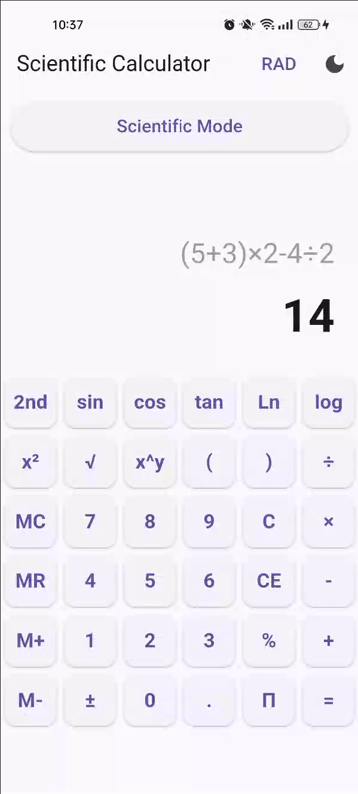
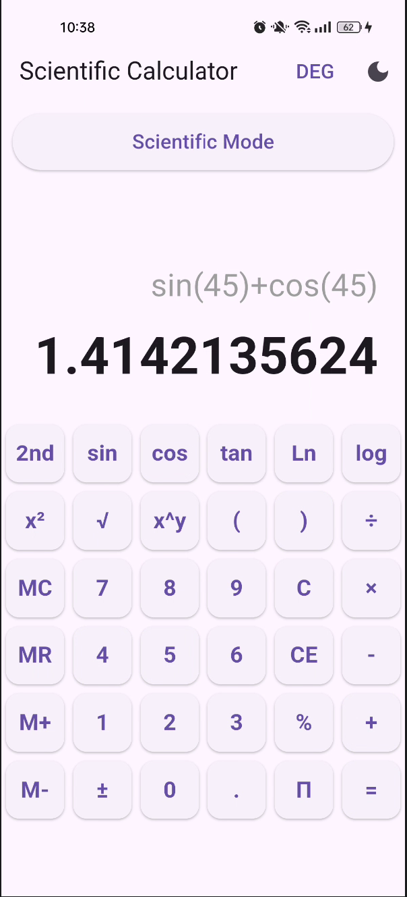
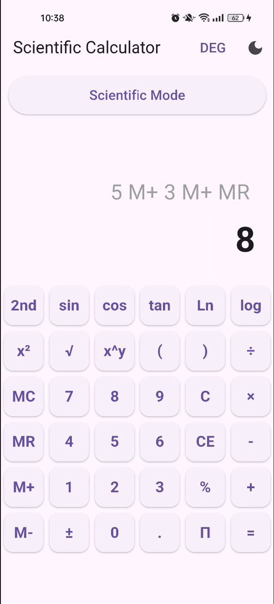
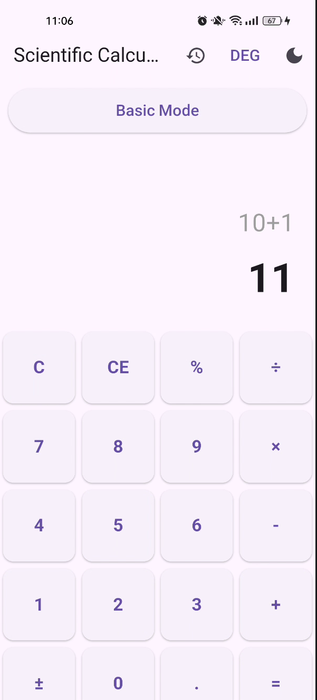
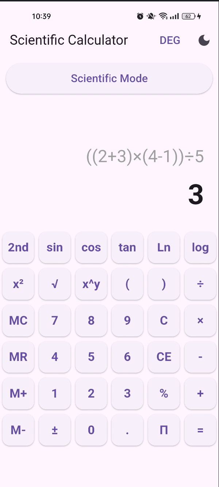
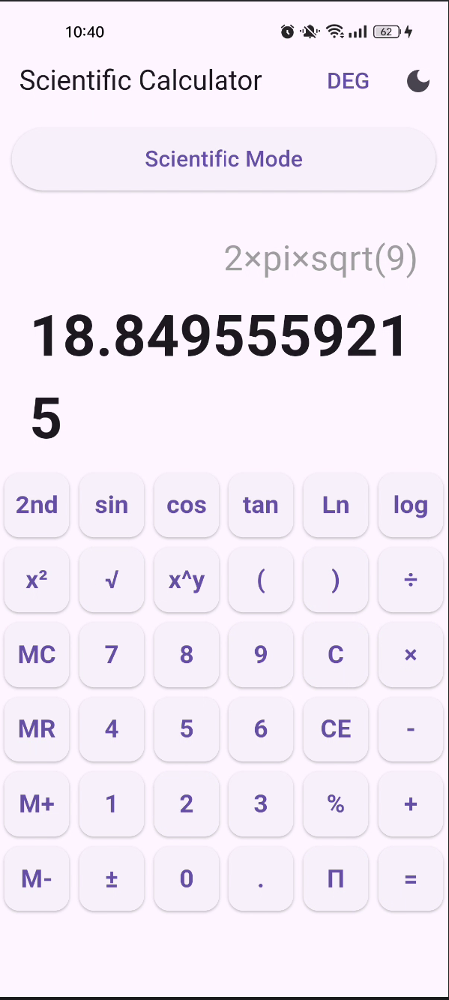

# Advanced Calculator App

Ứng dụng máy tính đa chế độ được phát triển bằng Flutter, hỗ trợ nhiều chức năng tính toán từ cơ bản đến nâng cao.

## Tính năng chính

### Basic Mode
- Các phép tính cơ bản: cộng, trừ, nhân, chia
- Phần trăm (%)
- Đổi dấu (±)
- Xóa toàn bộ / xóa từng ký tự

### Scientific Mode
- Hàm lượng giác: sin, cos, tan
- Logarithm: ln, log
- Căn bậc hai (√)
- Lũy thừa (x², x^y)
- Hằng số Pi (π)
- Chuyển đổi DEG / RAD

### Programmer Mode
- Chuyển đổi số:
  - Binary
  - Octal
  - Decimal
  - Hexadecimal
- Phép toán bitwise:
  - AND
  - OR
  - XOR
  - NOT

### Test
# Advanced Calculator - Test Results

## 1. Complex expressions  
(5 + 3) × 2 - 4 ÷ 2 = 14

---

## 2. Scientific calculations  
sin(45°) + cos(45°) ≈ 1.414

---

## 3. Memory operations  
5 M+ 3 M+ MR = 8

---

## 4. Chain calculations  
5 + 3 = + 2 = + 1 = 11

---

## 5. Parentheses nesting  
((2 + 3) × (4 - 1)) ÷ 5 = 3

---

## 6. Mixed scientific  
2 × π × √9 ≈ 18.85

